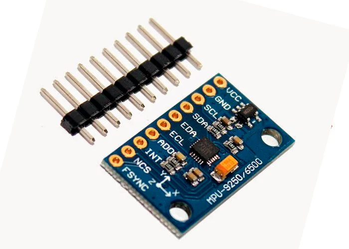

# Hardware

- ### Raspberry Pi Zero W

    <https://www.raspberrypi.com/products/raspberry-pi-zero-w/>
    
    Computadora principal, todos los módulos se conectan a esta. También encargada de ejecutar código en Python.
    
        
    
- ### BMP280

    <https://www.bosch-sensortec.com/products/environmental-sensors/pressure-sensors/bmp280/>

    Sensor de presión barométrica y temperatura.
    
    
    
- ### HDC1080

    <https://www.ti.com/product/HDC1080>
    
    Sensor de humedad y temperatura.
    
    
    
   
- ### MPU9250

    <https://invensense.tdk.com/products/motion-tracking/9-axis/mpu-9250/>
    
    Acelerómetro, giroscopio y magnetómetro
    
    
    
- ### NEO6M

    <https://www.u-blox.com/en/product/neo-6-series>
    
    Módulo GPS
    
    
