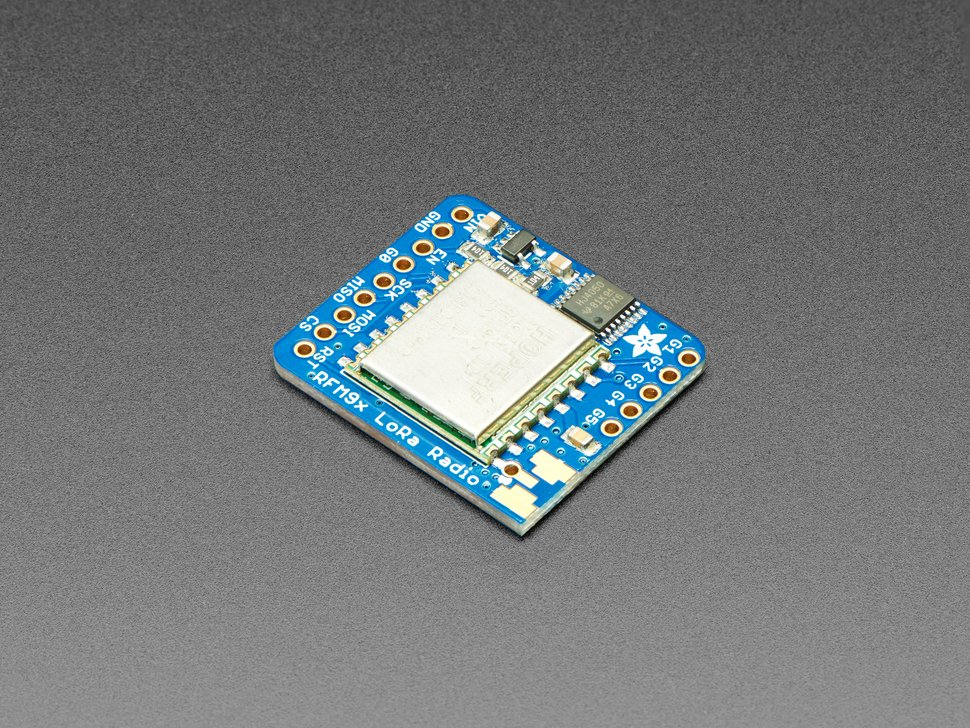

# Hardware CANSAT

## Placas y circuitos integrados

- ### Raspberry Pi Zero W

    <https://www.raspberrypi.com/products/raspberry-pi-zero-w/>
    
    Computadora principal, todos los módulos se conectan a esta. También encargada de ejecutar código en Python.
    
        
    
- ### GY91 (BMP280 + MPU9250)

    <https://electropeak.com/learn/interfacing-gy-91-9-axis-mpu9250-bmp280-module-with-arduino/>
    
    Combinación de sensores, el MPU9250 que trabaja como acelerómetro, giroscopio y magnetómetro, y el BMP280 sensor de presión barométrica
    
    
    
- ### HDC1080

    <https://www.ti.com/product/HDC1080>
    
    Sensor de humedad y temperatura.
    
    
    
- ### NEO6M

    <https://www.u-blox.com/en/product/neo-6-series>
    
    Módulo GPS
    
    

- ### RFM95W LoRa 915 MHz

    <https://www.adafruit.com/product/3072>
    
    Transmisor? en radio frecuencia
    
    Este es el único modulo que tengo dudas, no se nada de transmisiones por radio y según el link de arriba adafruit vende almenos 4 tipos distintos de lo mismo.
    
    Podrían haber más pistas aquí
    
    <https://github.com/Octa-Aerospace/OctaSat/blob/main/modules/transceiver.py>
    
    
    
- ### DM13 Step up 5V

    <https://solectroshop.com/es/convertidor-dc-a-dc-step-up/1619-modulo-de-alimentacion-5-v-con-salida-2a-paso-arriba-dm13.html>
    
    Amplificador de voltaje, de los 2.9v - 3.7v de la batería tipo 18650 hasta 5v requeridos por el Raspberry
    
    
    
    
## Componentes sencillos

- ### Buzzer

- ### Portapila 18650

# Hardware Estación en tierra

???

# Hardware extra

- ### Cargador de pilas 18650
    Ojala algún modelo con funciones de seguridad, trabajar con baterías puede ser peligroso