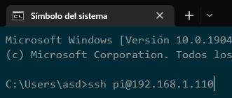

## Preparar entorno de desarrollo

- ### Configurar red

**Recomendación: Sacar el raspberry de la plaquita del cansat**

Conectar una pantalla por HDMI, un mouse/teclado en el puerto usb que está más al centro, un cargador de celular decente al puerto usb de la esquina y con suerte enciende.

En la interfaz gráfica logear con usuario pi y clave raspberry, configurar la red wifi y anotar la ip.

**Importante: No tener el cable usb y la batería al mismo tiempo**

- ### Conectarse a la raspberry por SSH en otro pc

En Windows recomiendo instalar *Windows Terminal* https://apps.microsoft.com/store/detail/windows-terminal/

Para verificar que el raspberry esta conectado a la red y que la ip anotada esta bien, toca conectarse por SSH de esta forma.

Si sale bien va a pedir la clave que es la misma *raspberry* y conectarse.

- ### Visual Studio Code y plugin de sincronización por SSH

Este plugin esta interesante, como ya no tengo el raspberry a mano no puedo probarlo pero se ve bien bueno

https://singleboardblog.com/coding-on-raspberry-pi-remotely-with-vscode/

## Ver si soldé bien las cosas ono

- ### Probar módulos I2C

Con el raspberry conectado a la placa del cansat y este energizado por usb o batería, se debería poder ver si los dos módulos de protocolo I2C funcionan, aquí hay algunas guías que explican como.

https://learn.adafruit.com/adding-a-real-time-clock-to-raspberry-pi/set-up-and-test-i2c

https://pi3g.com/2021/05/20/enabling-and-checking-i2c-on-the-raspberry-pi-using-the-command-line-for-your-own-scripts/

- ### Probar módulo GPS

Lo mismo pero con el GPS

https://www.instructables.com/Raspberry-Pi-the-Neo-6M-GPS/